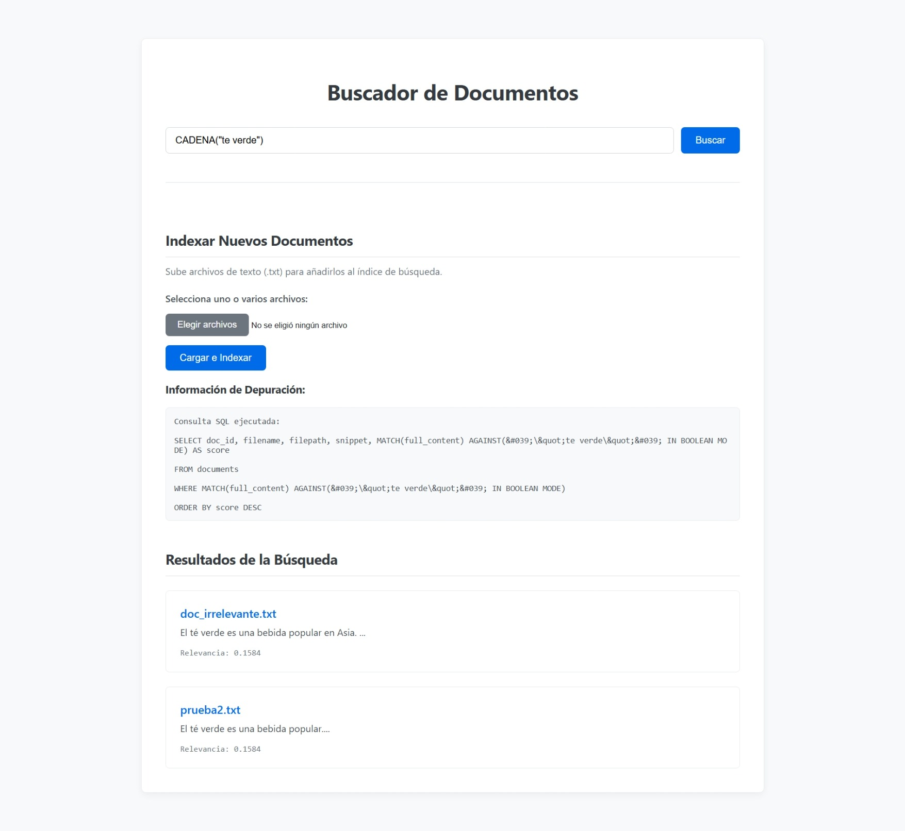

# BusinesSearch

## Motor de Búsqueda de Documentos con PHP y MySQL (Versión FULLTEXT)

Este proyecto implementa una aplicación web que funciona como un motor de búsqueda de documentos de texto plano. La aplicación permite a los usuarios subir archivos de texto (`.txt`) y luego realizar búsquedas complejas sobre el contenido de todos los documentos subidos. Los resultados se presentan ordenados por relevancia, mostrando primero los documentos más importantes para la consulta del usuario.

Esta versión ha sido **refactorizada para utilizar las capacidades nativas de MySQL FULLTEXT**, delegando la indexación y el cálculo de relevancia a la base de datos para obtener un rendimiento y una simplicidad significativamente mayores.

## Funcionamiento

El sistema se divide en dos procesos principales: **Indexación** y **Búsqueda**, ambos optimizados con `MySQL FULLTEXT`.

### 1. Indexación

Cuando un usuario sube uno o varios archivos de texto:

1.  **Recepción y Almacenamiento**: El `upload_handler.php` recibe los archivos y los guarda en una carpeta `uploads/` en el servidor.
2.  **Almacenamiento para Indexación**: El `indexer.php` lee el contenido completo de cada archivo y lo guarda en una columna `full_content` de la tabla `documents`.
3.  **Indexación Automática**: MySQL se encarga automáticamente de indexar el contenido de la columna `full_content` utilizando su motor `FULLTEXT`. No es necesario procesar el texto ni mantener un índice invertido manualmente en PHP.

### 2. Búsqueda

Cuando un usuario realiza una consulta:

1.  **Análisis de la Consulta**: El `parser.php` analiza la cadena de búsqueda, reconociendo operadores (`AND`, `OR`, `NOT`) y funciones especiales como `CADENA("frase exacta")` y `PATRON(patrón)`.
2.  **Traducción y Búsqueda**: El `search_engine.php` traduce la consulta del usuario a la sintaxis `MATCH...AGAINST` en modo booleano. Luego, ejecuta una única consulta `SELECT` en la base de datos.
3.  **Ranking y Presentación**: MySQL se encarga de encontrar los documentos, calcular una puntuación de relevancia (`score`) y devolver los resultados ya ordenados. La aplicación simplemente los muestra al usuario.

## Guía de Uso

### 1. Configuración Inicial

1.  **Servidor**: Asegurarse de tener un entorno de servidor web como XAMPP con Apache y MySQL en funcionamiento.
2.  **Base de Datos**:
    *   Importar el script `search_engine_db.sql` en un gestor de MySQL (como phpMyAdmin). Este script creará automáticamente la base de datos `search_engine_db_bs` y la tabla `documents`.
3.  **Conexión**: Verificar que las credenciales en `db_connection.php` sean correctas para el entorno de trabajo.
4.  **Directorio `uploads`**: El script creará automáticamente la carpeta `uploads/` la primera vez que subas un archivo. Asegurarse de que el servidor tenga permisos de escritura en el directorio del proyecto.

### 2. Probar la Indexación

1.  **Crear archivos de prueba**: Crear varios archivos `.txt` con contenido variado.
2.  **Subir los archivos**: Usar el formulario "Indexar Nuevos Documentos" en la página principal para subirlos.
3.  **Verificar la Base de Datos**: Con una herramienta como phpMyAdmin, revisar que la tabla `documents` se haya poblado con el contenido de los archivos subidos.
4.  **Probar la re-indexación**: Modificar uno de los archivos y vuelve a subirlo. El sistema lo reemplazará y MySQL lo re-indexará automáticamente.

### 3. Probar la Búsqueda y Relevancia

1.  **Búsqueda Simple**: Buscar un término que exista en los documentos cargados.
2.  **Búsqueda Booleana**: Probar combinaciones como `termino1 AND termino2`, `termino1 OR termino2` y `termino1 AND NOT termino2`.
3.  **Funciones Especiales**: Probar `CADENA("una frase exacta de tus documentos")` y `PATRON(parte_de_una_palabra)`.
4.  **Prueba de Relevancia**: El algoritmo de MySQL es una variante de TF-IDF. Un documento donde el término de búsqueda es más "raro" o importante en el contexto del documento recibirá una puntuación más alta.

## Comparativa de Versiones: Manual vs. MySQL FULLTEXT

Esta aplicación ha evolucionado desde una implementación manual de un índice invertido a una que utiliza el motor `FULLTEXT` de MySQL.

### Versión Anterior (Manual)

*   **Indexación**: PHP leía los archivos, los normalizaba, tokenizaba y calculaba frecuencias y posiciones. Se mantenía un índice invertido en dos tablas (`terms` y `postings`).
*   **Búsqueda**: PHP utilizaba el algoritmo Shunting-yard para evaluar la lógica booleana, realizaba múltiples consultas para obtener IDs de documentos y finalmente calculaba la relevancia con TF-IDF y Similitud del Coseno en código PHP.

### Versión Actual (MySQL FULLTEXT)

*   **Indexación**: PHP simplemente guarda el contenido completo del archivo en la base de datos. MySQL se encarga de todo el proceso de indexación.
*   **Búsqueda**: PHP traduce la consulta a la sintaxis de `MATCH...AGAINST` y ejecuta una única consulta. MySQL se encarga de la búsqueda, el ranking y la puntuación.

### Ventajas de la Versión Actual (MySQL FULLTEXT)

1.  **Rendimiento Superior**: El motor `FULLTEXT` de MySQL está escrito en C/C++ y es órdenes de magnitud más rápido que procesar la lógica en PHP.
2.  **Simplicidad y Mantenibilidad**: Se eliminaron cientos de líneas de código PHP complejo, reduciendo la probabilidad de errores y facilitando el mantenimiento.
3.  **Escalabilidad**: MySQL está diseñado para manejar grandes volúmenes de datos. Esta versión escala mucho mejor a medida que aumenta el número de documentos.
4.  **Funcionalidades Avanzadas**: Se obtiene acceso a características nativas de MySQL como *stemming* (lematización) y listas de *stopwords* optimizadas, que mejoran la calidad de la búsqueda sin esfuerzo adicional.

### Desventajas de la Versión Actual

1.  **Menor Control ("Caja Negra")**: Se pierde el control granular sobre el algoritmo de ranking. No podemos modificar la fórmula de relevancia de MySQL ni implementar algoritmos personalizados como la Similitud del Coseno de la misma manera.
2.  **Dependencia de la Configuración de MySQL**: El comportamiento de la búsqueda (ej. longitud mínima de palabra a indexar) depende de la configuración del servidor MySQL, no solo del código PHP.

En resumen, la versión anterior fue un excelente ejercicio académico para entender los fundamentos de los motores de búsqueda, pero la **versión actual con `MySQL FULLTEXT` es una solución mucho más profesional, eficiente y robusta** para una aplicación real.

## Interfaz y Ejemplos de uso

*Ejemplo de relevancia*

*Ejemplo de operador CADENA*

*Ejemplo de operador AND*

*Ejemplo de operador AND NOT*

*Ejemplo de operador OR*
